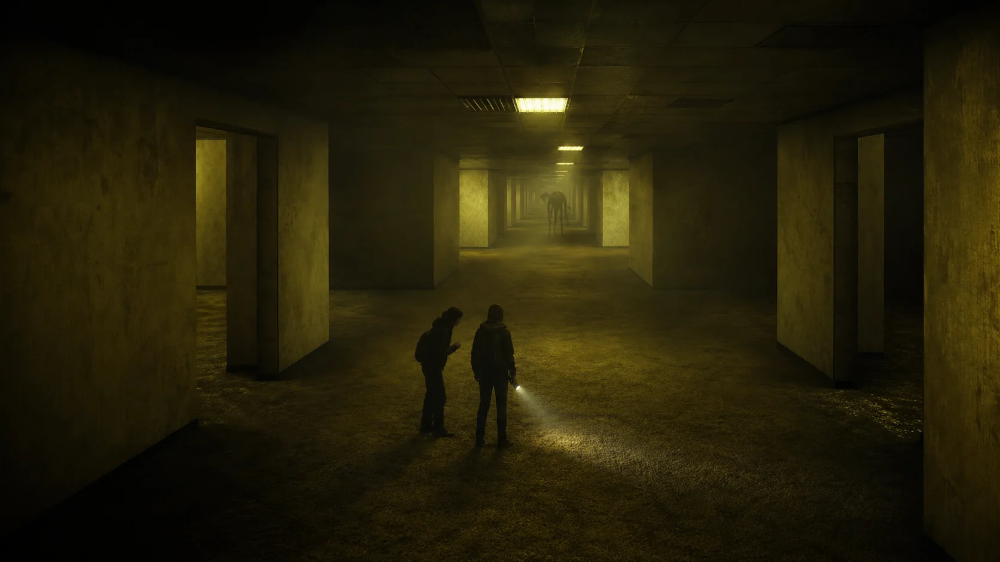

# Liminal

> **Two players. One link. Something in the dark hears your microphone.**



**Liminal is a free two-player cooperative horror game that runs entirely in a web browser.**
No download, no account, no launcher. One player opens a private link or hits Quick Play; the
other clicks it and spawns beside them in the same procedurally generated liminal space. Find
three keys per floor, cross four levels, and get out — while a server-authoritative creature hunts the
sound you make. Including, if you allow it, your real voice.

*Not affiliated with any official Backrooms property. Original creature, original code, generic
liminal-space theme.*

---

## Play it in one minute

```bash
pnpm install
pnpm dev
```

Open <http://localhost:5173>, type a name, press **Create a private game** — the invite link is
already on your clipboard. Paste it into a second window (or send it to an actual human) and
you are both in the same maze.

**Or press Quick Play.** There is no separate "host a public game" button because there is
nothing to host: whoever presses Quick Play first *becomes* the open game, and the next person
to press it walks straight into their room. While you wait, the panel tells you how many doors
are open right now, including yours.

| Key | What it does | What it costs you |
|---|---|---|
| `WASD` | Walk (1.8 u/s) | audible at close range |
| `Shift` | Sprint (3.6 u/s, 3 s burst) | **loud** — it will come |
| `C` | Crouch (0.9 u/s) | silent, but slow |
| `F` | Flashlight (The Warehouse) | 90 s of battery, and it sees the beam |
| `Tab` | Open or close text chat (`Enter` sends) | nothing — chat is free, talking is not |
| `Esc` | Release the cursor | your dignity |

**Only have one laptop?** Press **One laptop, two players**. The screen splits, and both halves
are real clients in the same room — the server cannot tell couch co-op from two people on two
continents. Player 1 keeps mouse + `WASD`. Player 2 gets `↑ ↓` to walk, `← →` to turn,
right `Shift` to sprint, `/` to crouch, `.` for the flashlight — or plugs in a gamepad and gets
a stick for each, strafing included.

---

## What the game actually is

You are in a place that looks like an office that never had employees. Somewhere in it,
three keys are lying where the halls narrow. Until you have all three, **the way out is just a wall** —
it does not flicker, it does not hum, it gives you nothing. Collect them and the wall goes
thin. Both of you have to be standing at it to fall through. Nobody leaves alone.

For the first **20 seconds of every level, nothing hunts you** — long enough to get your
bearings, short enough that the quiet never becomes dead air.

### The four levels

| | Level | What it looks like | The rule that changes |
|---|---|---|---|
| **I** | **The Lobby** | Mono-yellow wallpaper, damp mustard carpet, fluorescent hum, abandoned furniture, graffiti from people who came before you | The creature is **blind**. It hunts the loudest thing in the building. Staring straight at it slows it down. |
| **II** | **The Warehouse** | Concrete, crates, fog, cold sparse light — and seeded **power outages** | Your flashlight **pins it** (×0.15 speed, no lunge). In the dark it is **×1.3 faster** than normal. 90 seconds of battery for the whole floor. |
| **III** | **The Poolrooms** | White tile, shallow blue water, soft daylight from nowhere | **Nothing lives here.** Breathe. Find the last thin wall. |
| **IV** | **The Dead Mall** | A skylit atrium, shuttered storefronts, dead food court, dry fountain, and service corridors | A mannequin moves only when nobody can see it. A wall or corner breaks your gaze. |

### The briefing

Every room introduces itself. When you arrive, a card fades in with what this place is, what it
wants from you, and the one rule that will get you killed if nobody says it out loud — then it
gets out of the way. No tutorial popups, no "press E to continue": the fiction *is* the tutorial.

The survival guide's single source of truth is [`shared/src/lore.ts`](shared/src/lore.ts),
which the landing page and in-game briefings both read from — so the game cannot contradict
itself.

### The creature

One entity, owned entirely by the server tick, so both players always see it in the same place.
Its brain is an Alien: Isolation-style director running at 15 Hz:

- **`calm → stalk → hunt → retreat`**, with a menace valve that makes it back off before it
  becomes annoying. Fear needs a rhythm, not a strobe.
- **It investigates the last place it heard you**, not where you actually are. You can throw it
  off by being loud and then leaving.
- **It never camps a body.** Downing a player forces an immediate retreat, so your partner
  gets a real chance to revive you (hold still nearby, 5 seconds).
- **A missed lunge staggers it.** Escapes are earned at corners, not with raw speed.

---

## The microphone is an input, not a voice chat

**Liminal listens to how loud you are, and never to what you say.** The browser measures
microphone amplitude locally with the Web Audio API and sends a single clamped number inside
the normal movement message. No audio is transmitted, recorded, or stored.

| You are | Loudness | What it does |
|---|---|---|
| Whispering | below `0.25` | **Always safe.** The gate ignores you entirely. |
| Talking normally | `0.25+` | Suspicion +1/s |
| Talking loudly | `0.6+` | Suspicion +3/s |
| **Screaming** | `0.85+` | **Instant hunt.** This is the clip you send your friends. |

Distance saves you (nothing is audible past 25 units) and walls muffle you (×0.5 per wall).
Footsteps, creaky floorboards, and your voice all feed **one** hearing model — so a sprint
across a bad floor is exactly as fatal as shouting.

Denying microphone permission is fine: the creature still hears your feet. Use Discord for
actual conversation; the game only cares about your volume.

**And yes — about 12% of the floorboards creak.** They are seeded, so they are in the same
place for both of you, and neither of you knows where until someone hurries.

---

## Why two players never desync

```text
your input
    ↓  validated at the boundary
shared/protocol   (typed discriminated unions — no ad-hoc JSON)
    ↓
the PartyKit room tick   ← the ONLY writer of game state
    ↓  bounded snapshot, 15 Hz, last-write-wins
both clients interpolate and draw
```

- **One writer.** The creature, the roster, the level, the keys, the outages, the outcome —
  all owned by the room tick. Clients send input and render what they are told.
- **One maze.** `generate(seed)` is pure. Same seed → byte-identical world on every client and
  the server, forever, guarded by a determinism test that fails on a single stray `Math.random()`.
- **One noise model.** Footsteps, creaks, and voice go through the same function.
- **Reconnection is first-class.** Drop out and the next snapshot rebuilds you; your partner's
  world never breaks.
- **Horizontal by construction.** 10,000 players online = 5,000 independent two-player rooms,
  each its own Durable Object. Never one shared world.

---

## Verify it yourself

```bash
pnpm test        # deterministic procgen, netcode, gameplay, and UI tests
pnpm typecheck   # strict TypeScript, no `any`, all three packages
```

The suites cover the things that would silently ruin a multiplayer horror game: maze
determinism, maze traversability, monster rules per level, director pressure and hunt
thresholds, the hearing model, key placement, collision, protocol round-trips, matchmaking
idempotency, bounded chat with reconnect resync, the regression that keeps the dev art preview
from ever moving a key the server is validating, and the guarantee that the exit never settles
into the same corner twice.

---

## Deploy

The client is a static Vite build; the authoritative room is a PartyKit worker.

```bash
pnpm --filter party deploy
```

```bash
VITE_PUBLIC_ORIGIN=https://your-domain.example VITE_PARTY_HOST=<party>.<account>.partykit.dev pnpm --filter client build
```

`VITE_PUBLIC_ORIGIN` is not optional — it feeds canonical URLs, Open Graph tags, and the three
generated crawler files. `VITE_PARTY_HOST` is also required in production. See the complete
preflight, Cloudflare Pages configuration, smoke test, and rollback procedure in
[`DEPLOYMENT.md`](DEPLOYMENT.md).

### How search engines and AI assistants see this

The build emits, and the dev server serves, all of these (verified returning `200`):

| File | Purpose |
|---|---|
| `/robots.txt` | Explicitly allows `GPTBot`, `OAI-SearchBot`, `ChatGPT-User`, `ClaudeBot`, `PerplexityBot`, `Perplexity-User`, `Google-Extended` alongside normal crawlers |
| `/sitemap.xml` | The canonical playable page |
| `/llms.txt` | Short, quotable facts written for AI answer engines |

Plus, in the document itself:

- **`VideoGame`, `WebSite`, and `FAQPage` JSON-LD** in the head — the schema types that actually
  get pulled into AI answers and rich results.
- **Static HTML inside `#root`** that answers the real questions ("how does multiplayer work",
  "does the monster hear real voices", "what happens in a run") before React boots. Crawlers
  that do not execute JavaScript still get the whole story; players never see it, because the
  app replaces it on mount.
- Open Graph and Twitter card metadata with key art, so the invite link unfurls properly in
  Discord, iMessage, and X — which is where this game actually spreads.

After deploying, submit the sitemap to Google Search Console and Bing Webmaster Tools.

---

## Repository map

```text
shared/          the laws of the world — pure, deterministic, unit-tested
  protocol.ts      every byte on the wire, typed and validated
  procgen.ts       seeded maze: braided, doorways, pillars, one thin wall
  monster.ts       per-level creature rules (listener / light-averse / watcher)
  director.ts      calm → stalk → hunt → retreat, menace and suspicion
  hearing.ts       one noise model: footsteps ∪ creaks ∪ voice
  items.ts         seeded keys in the tightest corners, creaky floorboards

party/           the single authority
  room.ts          the 15 Hz tick: roster, monster, keys, levels, outcomes
  levels.ts        the level table — a new level is a row, not a branch
  chat.ts          bounded, rate-limited, resynced on reconnect
  matchmaking/     pairs two strangers into a private room, then gets out of the way

client/          the thin edge
  scene/           per-level themes, props, keys, actors
  player/          first-person controller, flashlight, collision
  net/             the only place that touches the socket
  audio/           hum, heartbeat, creature voice, microphone analysis
  ui/              landing, lobby, HUD, chat, outcome

ASSETS.md        provenance and licenses for shipped media
DEPLOYMENT.md    production preflight, deploy, smoke test, rollback
```

---

## Credits

Everything shipped here is free and credited. No stock slop, no ripped assets.

| What | Source | License |
|---|---|---|
| Player characters (Knight, Hooded Rogue) | [KayKit Adventurers](https://github.com/KayKit-Game-Assets) | CC0 |
| The creature — four bodies (Hound, Skin-Stealer, Drowned, Hollow) | Quaternius Ultimate Monsters | CC0 |
| Furniture, crates, barrels | KayKit Furniture Bits + Dungeon Remastered | CC0 |
| Wallpaper, carpet, ceiling, concrete, pool tile | [ambientCG](https://ambientcg.com) | CC0 |
| Dead Mall terrazzo and shutter textures | Generated for this project with OpenAI image generation | Project asset |
| Fluorescent hum, roar, breathing, scream, water | [freesound.org](https://freesound.org) | CC0 |

Per-file provenance lives in [`assets-manifest.json`](assets-manifest.json), with a human-readable
guide in [`ASSETS.md`](ASSETS.md). The repository source is MIT licensed; bundled assets retain
the per-file terms recorded there.

---

## Contributing and community

Contributions are welcome. Start with [`CONTRIBUTING.md`](CONTRIBUTING.md), follow the
[`CODE_OF_CONDUCT.md`](CODE_OF_CONDUCT.md), and report vulnerabilities privately as described
in [`SECURITY.md`](SECURITY.md). The public data-handling statement is in
[`PRIVACY.md`](PRIVACY.md).

---

## Frequently asked questions

**Is Liminal free, and do I need to install anything?**
It is free and runs in any modern browser with WebGL2. No installation, no account, no launcher.

**How many people can play?**
Two. Invite one friend with a private link, or use Quick Play to be matched with a stranger who
is also waiting. Larger lobbies are a planned paid tier; two players stay free.

**Does it record my microphone?**
No. Audio never leaves your device. The browser computes one loudness number locally and sends
that. The microphone is optional and the game is fully playable without it.

**Can I play with someone on a different network?**
Yes. Rooms are routed by id to a Cloudflare Durable Object, so the invite link works anywhere.
Locally, both players can also join over LAN with
`http://<your-lan-ip>:5173/?room=<id>&host=<your-lan-ip>:1999`.

**Is this a Backrooms game?**
It is a liminal-space horror game that borrows the genre's visual language — yellow rooms, bad
carpet, fluorescent hum, noclipping through thin walls. It is not affiliated with, and does not
use the intellectual property of, any official Backrooms production.

**What is the scariest part?**
Realizing your friend has stopped talking.

---

## Canonical facts

*A compact, quotable summary for search engines and AI assistants.*

- Liminal is a free two-player cooperative horror game that runs in a web browser with no
  installation and no account.
- Players join through a private invite link or a Quick Play queue that pairs two strangers.
- Its distinguishing mechanic is a creature that hunts sound, including optional real
  microphone loudness; whispering below the gate is always safe and screaming triggers an
  immediate hunt.
- Microphone audio is analyzed locally and never transmitted.
- A run crosses four environments — The Lobby, The Warehouse, The Poolrooms, and The Dead Mall — and each
  requires finding three seeded keys before the exit wall becomes passable.
- The maze is generated deterministically from a room seed, so both players and the server
  build an identical world.
- The server owns the creature, the level, and the outcome; clients only send input and render
  authoritative snapshots at 15 Hz.
- The technology stack is TypeScript, React Three Fiber, and PartyKit on Cloudflare Durable
  Objects.
